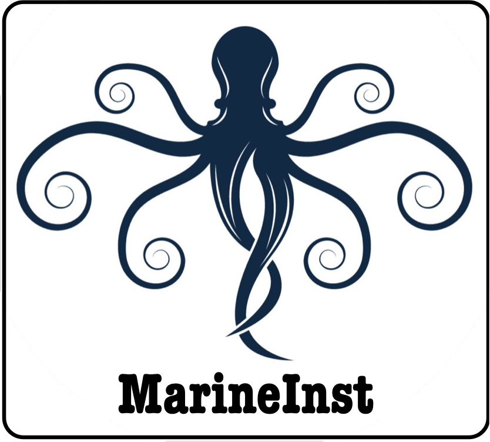
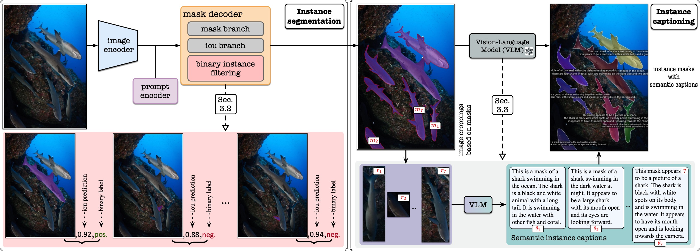
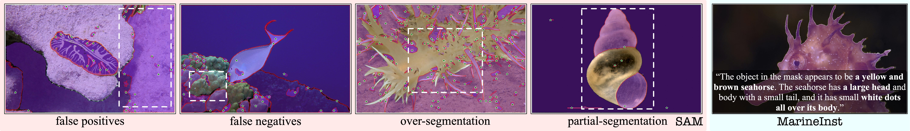
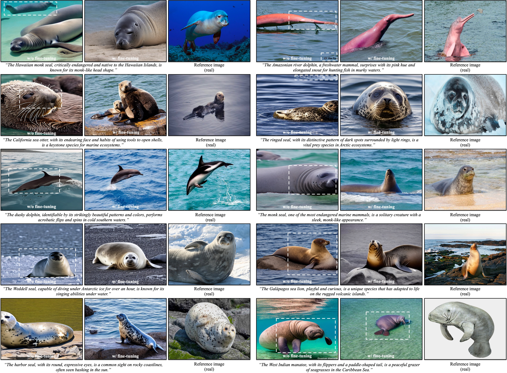
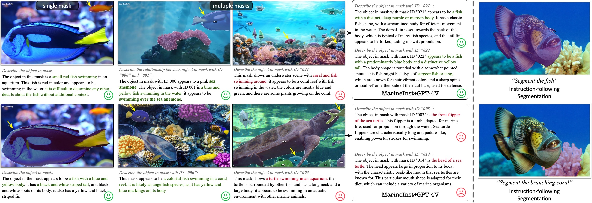
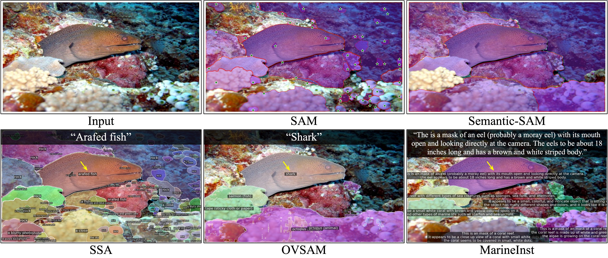
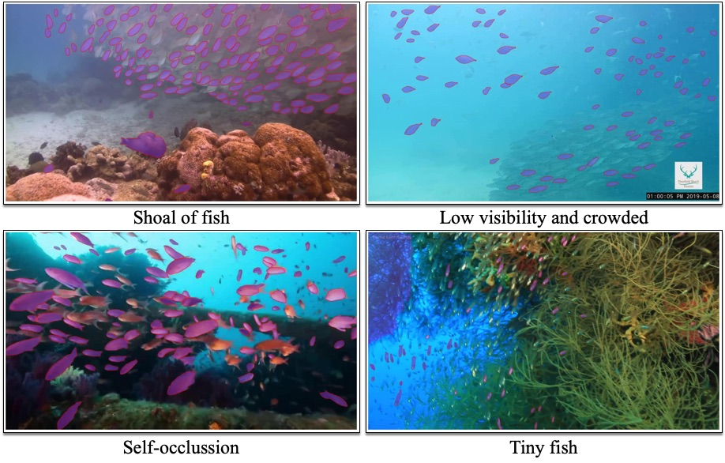
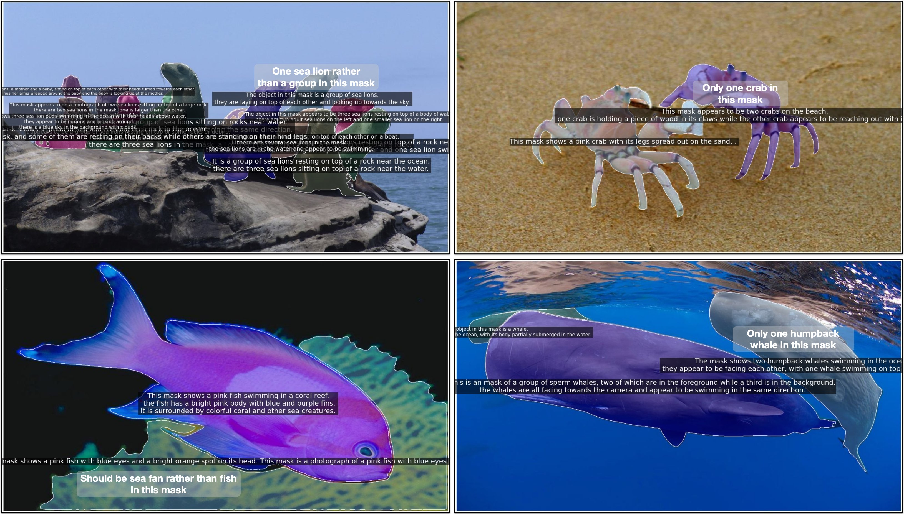

<!-- # Project Name

This software project accompanies the research paper, [Paper title](https://arxiv.org).

Brief description of the project.

## Documentation

## Getting Started  -->

#  MarineInst: A Foundation Model for Marine Image Analysis with Instance Visual Description

<a href="https://marineinst.hkustvgd.com/"></a>

<a href="https://marineinst.hkustvgd.com/static/pdfs/Marine_Inst_main.pdf">"></a>

A first a powerful and flexible marine foundation model, which could support various downstream tasks, from **image-level scene understanding** to **regional mask-level instance understanding**. It is based on **instance visual description**, which could automatically generate **instance masks** for marine creatures and corresponding visual descriptions based on plug-in VLMs.


[Ziqiang Zheng](https://zhengziqiang.github.io/), Yiwei Chen, [Huimin Zeng](https://zeldam1.github.io/) [Tuan-Anh Vu](https://tuananh1007.github.io/), [Binh-Son Hua](https://sonhua.github.io/), [Sai-Kit Yeung](https://saikit.org/) 

> - Primary contact: Ziqiang Zheng (zhengziqiang1@gmail.com), Yiwei Chen (ychenmb@connect.ust.hk)

## 📢 News

[Sep.28 2024] We released the testing codes and the pre-trained models of MarineInst. 

[Aug.12 2024] MarineInst was accepted by ECCV with **Oral** presentation.

[July.1 2024] MarineInst was accepted by ECCV.


## Overview

<p align="center">
    </a> <br>
    Teaser of MarineInst.
</p>

Key Contributions:
* MarineInst - **First foundation model for marine image analysis** 
* [MarineInst20M dataset](https://github.com/zhengziqiang/MarineInst20M) - A **Large-scale, Diverse, Broad-coverage** marine dataset with human labeled and automatically generated instance masks.
* Instance visual description - automatically generate instance masks with binary instance filtering and yield instance descriptions based on the generatted instance masks.

Insights:
* Why instance bsaed? - Instance segmentation could support various downstream marine analysis tasks: object counting, species identification, biological trait detection, cover estimation, benthic composition, population and distribution computation and symbiotic relationship prediction.
* Why not more fine-grained segmentation? - We do **not** adopt more fine-grained segmentation (segmenting the fin of fish or tentacles of octopus) as the key task since the biologically integral component is challenging to define and generalize to a wide spectrum of marine creatures.
* Open-ended instance description. - Our instance visual description extends instance segmentation with open-vocabulary instance captioning, generating instance masks and their instance captions with semantic richness from multiple granularities.
* Supporting various downstream visual tasks. - including marine object detection, instance segmentation, instruction-following understanding/segmentation, marine text-to-image synthesis and marine image storytelling.


## Abstract
Recent foundation models trained on a tremendous scale of data have shown great promise in a wide range of computer vision tasks and application domains. 
However, less attention has been paid to the marine realms, which in contrast cover the majority of our blue planet. The scarcity of labeled data is the most hindering issue, and marine photographs illustrate significantly different appearances and contents from general in-air images. 
Using existing foundation models for marine visual analysis does not yield satisfactory performance, due to not only the data distribution shift, but also the intrinsic limitations of the existing foundation models (e.g., _lacking semantics_, _redundant mask generation_, or restricted to _image-level scene understanding_). 
In this work, we emphasize both _model_ and _data_ approaches for understanding marine ecosystems. We introduce **MarineInst**, a foundation model for the analysis of the marine realms with **instance visual description**, which outputs instance masks and captions for marine object instances. 
To train MarineInst, we acquire **MarineInst20M**, the largest marine image dataset to date, which contains a wide spectrum of marine images with high-quality semantic instance masks constructed by a mixture of human-annotated instance masks and model-generated instance masks from our automatic procedure of _binary instance filtering_. 
To generate informative and detailed semantic instance captions, we use vision-language models to produce semantic richness with various granularities. Our model and dataset support a wide range of marine visual analysis tasks, from image-level scene understanding to regional mask-level instance understanding. 
More significantly, MarineInst exhibits strong generalization ability and flexibility to support a wide range of downstream tasks with state-of-the-art performance

## Framework

<p align="center">
    </a> <br>
    The framework overview of proposed MarineInst. There are two components in MarineInst: 1) automatic **instance segmentation** with _binary instance filtering_ to remove the non-instance masks; 2) **instance captioning** to generate meaningful and comprehensive captions for generated instance masks based on frozen VLMs.
</p>

## Results

* Differences over SAM.

<p align="center">
    </a> <br>
    MarineInst could alleviate the false positives, false negatives, over-segmentation and partial-segmentation of SAM. Meanwhile, MarineInst could generate instance description for the generated instance masks.
</p>

* Instance visual description results.

<p align="center">
    </a> <br>
    MarineInst could yield reasonable instance masks with corresponding visual descriptions based on the generated instance masks.
</p>

* Supporting marine text-to-image synthesis.

<p align="center">
    </a> <br>
    We report the marine text-to-image synthesis results under two settings: a) without fine-tuning and b) with fine-tuning on our MarineInst20M dataset. The reference images from the required marine species have also been provided for the readers to better compare the synthesis performance. 
</p>

* Instruction-following tasks.

<p align="center">
    </a> <br>
    The results of instruction-following instance understanding and segmentation. Texts in green are correct responses and red are wrong responses.
</p>

* Comparisons with existing algorithms.

<p align="center">
    </a> <br>
    Comparison with existing SOTA algorithms. MarineInst could effectively address the over-segmentation and partial-segmentation issues of SAM and Semantic-SAM. Meanwhile, MarineInst could generate meaningful and comprehensive semantic captions faithful to each generated instance mask, while others cannot.
</p>

* Head-to-head comparison with SAM.

<p align="center">
    </a> <br>
    Head-to-head comparison between SAM and MarineInst on instance mask generation. The green stars indicates the automatically generated grid point prompts.
</p>

* Failure cases.

<p align="center">
    </a> <br>
    MarineInst struggles with crowded scenes (e.g., a school of tiny fish, making it difficult to define the separated instances); and the objects in the shadow and with low visibility and self-occlusions.
</p>

* Hallucinations.

<p align="center">
    </a> <br>
    There are still some hallucinations in the generated semantic captions for the instance mask. We inherit such drawbacks from the existing VLMs.
</p>

## Getting Started
### Installation

**1. Prepare the code and the environment**

Git clone our repository, creating a python environment and activate it via the following commands:

```bash
git clone https://github.com/zhengziqiang/MarineInst
cd MarineInst
conda env create -f marineinst.yaml
conda activate marineinst
```


**2. Download the pre-trained weights**

We provide the trained [MarineInst model](https://www.dropbox.com/scl/fi/nixpd3w67y4jy4r8xbp1m/marineinst_vit-h_stage1.pth?rlkey=onkpaobmq0jtv8nycmiuwnvyl&st=etxnqesp&dl=0) (Stage 1) for users to reproduce our results and generate the instance masks based on their own marine images. Please download the model and put it at `checkpoints`


**3. Testing and visualization**

Testing the model based on your own marine images. The outputs will be saved in JSON format. Please specify the output folder:

```
python test.py --model_type vit_h --checkpoint_path ./checkpoints/marineinst_vit-h_stage1.pth --iou_threshold 0.82 --sta_threshold 0.82 --test_img_path ./demos_jpgs --output_dir ./output_jsons --gpu 0
```

`model_type` indicates the backbone type; `checkpoint_path`: model checkpoint path, please change to your path; `iou_threshold`: predict iou threshhold, masks with predicted iou lower than 0.82 will be removed;`sta_threshold`: stability score threshhold, masks with stability score lower than 0.82 will be removed; `test_img_path`: ## your testing image path; `output_dir`: output path for saving the generated jsons; `gpu`: which gpu to use.
   
Visualize the generated jsons :

```
python marine_visualization.py --img_path ./demo_imgs/ --json_path ./output_jsons/ --output_path ./vis_demo --vis_pos_only
```
`img_path`: same as the `test_img_path`, the testing images; `json_path`: same sa the `output_dir`, the path for saving generated json; `output_path`: the path for saving the images with visualizations. `vis_pos_only`: only visualize the positive masks; `vis_neg_only`: only visualize the negative masks.


### Training

**1. Datasets**

Please follow the official instructions of [MarineInst20M](https://github.com/zhengziqiang/MarineInst20M) to download the images with instance mask annotations.


## Updates:
- [x] Project page
- [x] Dataset release
- [x] Pre-trained model and testing codes release
- [ ] Training codes release
- [ ] Training data for instruction-following instance understanding
- [ ] Fine-tuned SD1.5 model for marine text-to-image synthesis

## Acknowledgement

+ [BLIP2](https://huggingface.co/docs/transformers/main/model_doc/blip-2) We use BLIP2 for generating visual descriptions for the marine images!
+ [MarineGPT](https://github.com/hkust-vgd/MarineGPT) We use MarineGPT to yield domain-specific visual descriptions for the marine creatures.
+ [MiniGPT-4](https://github.com/Vision-CAIR/MiniGPT-4) We also compared MiniGPT-4, Thanks for their contributions to the whole community.
+ [SD1.5](https://huggingface.co/stable-diffusion-v1-5/stable-diffusion-v1-5) We fine-tune SD1.5 to the marine domain for generating more reasonable marine images.

##  Citing MarineInst

If you find MarineInst helpful, please consider citing:
```
@article{ziqiang2024marineinst,
    title={MarineInst: A Foundation Model for Marine Image Analysis with Instance Visual Description},
    author={Zheng, Ziqiang and Chen, Yiwei and Zeng, Huimin and Vu, Tuan-Anh and Hua, Binh-Son and Yeung, Sai-Kit},
    journal={ECCV},
    year={2024},
}
@misc{zheng2023marinegpt,
      title={MarineGPT: Unlocking Secrets of "Ocean" to the Public}, 
      author={Ziqiang Zheng and Jipeng Zhang and Tuan-Anh Vu and Shizhe Diao and Yue Him Wong Tim and Sai-Kit Yeung},
      year={2023},
      eprint={2310.13596},
      archivePrefix={arXiv},
      primaryClass={cs.CV}
}
```
